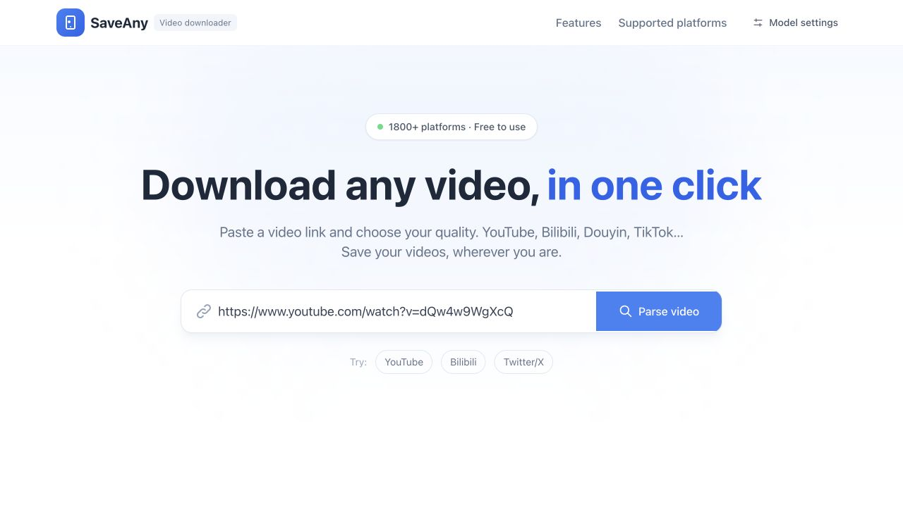
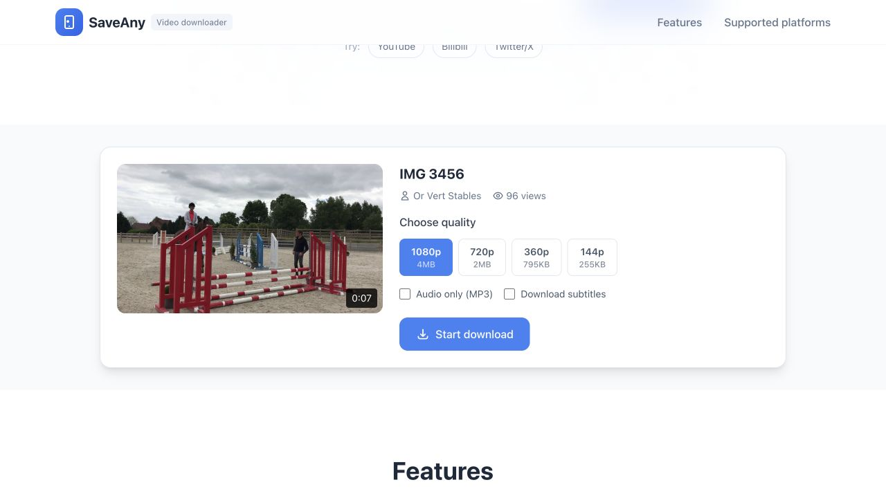
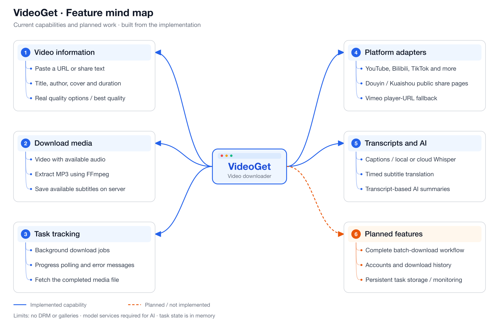

# VideoGet

**English** | [简体中文](README.zh-CN.md)

A web-based video downloader built with Vue 3, FastAPI, yt-dlp, and FFmpeg. Paste a video link, inspect its available quality options, and download the video or extract an MP3.

VideoGet is an early MVP. The download workflow uses real backend APIs; some features advertised in the original project documents are still planned.

## Screenshots

These captures show the actual English interface, using the SaveAny branding, and a real YouTube video parsed by the backend. Open [the English interface](http://localhost:3000/?lang=en) with `?lang=en`; `?lang=zh-CN` selects Chinese.

<p>
  
  
</p>

## Feature mind map

Blue branches describe implemented capabilities; the orange branch contains planned features.



[Editable SVG](docs/images/feature-mindmap.en.svg) · [中文导图](docs/images/feature-mindmap.zh-CN.png)

To regenerate both maps, run `python3 scripts/generate-feature-maps.py` with `rsvg-convert` installed.

## Features

- Parse video titles, authors, thumbnails, durations, and available quality options.
- Download videos with audio, or extract audio as MP3.
- Track background downloads with a progress indicator.
- Extract existing captions or transcribe speech using cloud or local Whisper; download SRT and TXT results.
- Translate timed subtitles and generate transcript-based AI summaries with a configured model service.
- Parse public Douyin and Kuaishou mobile share pages with built-in adapters.
- Use optional server-side cookies and known video passwords for authorized content.
- Responsive Vue interface and Docker Compose setup.

AI features require model configuration; missing credentials are shown in the interface. A complete batch-download workflow, accounts, and persistent download history are not implemented. Video downloads expose available subtitle files and report when none were downloaded.

## Platform support

| Platform | Implementation | Sample verification |
| --- | --- | --- |
| YouTube | yt-dlp | Download and file delivery passed |
| Bilibili | yt-dlp with thumbnail fallback | Download and file delivery passed |
| Douyin / 抖音 | Built-in mobile share-page parser | Video and MP3 downloads passed |
| Kuaishou / 快手 | Built-in mobile share-page parser | Download and file delivery passed |
| TikTok | yt-dlp | Download and file delivery passed |
| Instagram | yt-dlp | Download and file delivery passed |
| Twitter / X | yt-dlp | Download and file delivery passed |
| Facebook | yt-dlp; best-quality option when dimensions are unknown | Download and file delivery passed |
| Vimeo | yt-dlp with player-URL fallback | Password-protected fixture passed with its documented password |
| Twitch | yt-dlp | Clip download and file delivery passed |

These results describe individual samples tested on the `dev` branch with yt-dlp `2026.8.19`. Successful samples were checked for file delivery and valid media using FFprobe. They do not guarantee that every video on a platform can be downloaded. Other websites supported by yt-dlp may also work.

Douyin and Kuaishou adapters support video posts, not image galleries. Douyin reuses guest-session cookies and retries temporary empty responses. Neither adapter requires the previously missing `backend/third_party` directory.

Vimeo's original test sample requires a password. Another public sample exposed DRM-protected streams and could not be downloaded. Private, login-required, password-protected, region-restricted, and DRM-protected content remain subject to their original restrictions; DRM downloads are not supported.

## Requirements

- Python 3.11 or newer.
- Node.js 20 or newer and npm.
- FFmpeg and FFprobe available on `PATH` for media merging, MP3 conversion, and live verification.
- Docker with Docker Compose, if using containers. The backend image includes FFmpeg.

## Quick start

The commands below use Bash or zsh. Clone `main` for the default version; ongoing development uses `dev`.

```bash
git clone https://github.com/aurora-03/VideoGet.git
cd VideoGet
```

### Local development

Start the backend in one terminal:

```bash
cd backend
python3 -m venv .venv
source .venv/bin/activate
python -m pip install -r requirements.txt
cp .env.example .env
python main.py
```

On Windows PowerShell, activate the environment with `.\.venv\Scripts\Activate.ps1`.

Start the frontend in a second terminal, from the repository root:

```bash
cd frontend
npm ci
npm run dev
```

- Frontend: [http://localhost:3000](http://localhost:3000)
- Backend: [http://localhost:8000](http://localhost:8000)
- API documentation: [Swagger UI](http://localhost:8000/docs) / [ReDoc](http://localhost:8000/redoc)

### Docker Compose

From the repository root:

```bash
cp backend/.env.example backend/.env
mkdir -p backend/downloads
docker compose up --build -d
```

The frontend and backend use the same ports as local development. Downloaded files are persisted in `backend/downloads`.

The frontend defaults to `http://localhost:8000/api`. Set `VITE_API_BASE_URL` using `frontend/.env` before hosting remotely, using HTTPS, or accessing from another device, and configure backend CORS origins. The frontend container currently runs Vite's preview server; production deployment configuration still needs improvement.

## Configuration

Backend settings are loaded from `backend/.env` before download services are initialized.

| Variable | Default | Purpose |
| --- | --- | --- |
| `HOST` | `0.0.0.0` | Backend bind address |
| `PORT` | `8000` | Backend port |
| `DOWNLOAD_DIR` | `./downloads` | Media storage, relative to the backend working directory |
| `ALLOWED_ORIGINS` | `http://localhost:3000,http://127.0.0.1:3000` in `.env.example` | Comma-separated CORS origins |
| `YTDLP_COOKIE_FILE` | Unset | Path to an authorized Netscape-format cookie file |
| `YTDLP_VIDEO_PASSWORD` | Unset | Known password for password-protected videos |
| `CLOUD_BASE_URL` | `https://api.openai.com/v1` in the example | Shared cloud API base URL for all three operations |
| `CLOUD_API_KEY` | Unset | Shared server-side cloud API key |
| `CLOUD_ASR_MODEL` | `whisper-1` in the example | Cloud speech transcription model |
| `CLOUD_TRANSLATION_MODEL` | `gpt-4o-mini` in the example | Cloud subtitle translation model |
| `CLOUD_SUMMARY_MODEL` | `gpt-4o-mini` in the example | Cloud summary model |
| `AI_PROVIDER` | `openai` | `openai`, explicit custom gateway (`custom`), or local `ollama` |
| `AI_BASE_URL` | Shared cloud address | Optional separate text model API base URL |
| `AI_MODEL` | `gpt-4o-mini` for OpenAI mode | Fallback text model; required for local Ollama |
| `AI_API_KEY` | Shared cloud key | Optional separate text service key |
| `ASR_BACKEND` | `api` | `api` or local Faster Whisper (`local`) |
| `ASR_MODEL` | `whisper-1` / `base` | Cloud / local speech model |
| `ASR_BASE_URL` | Shared cloud address | Optional separate timestamped speech service address |
| `ASR_API_KEY` | Shared cloud key | Optional separate speech service key |
| `ANALYSIS_MAX_DURATION` | `7200` | Maximum known video duration for analysis, in seconds |

`MAX_FILE_SIZE` appears in `.env.example`, but is not currently enforced. Task state is held in memory and is lost when the backend restarts. Rate limiting and automatic file cleanup are not implemented.

Cookie files must be readable by the backend. In Docker, use a container-visible path and mount the file read-only. Keep cookie files and passwords out of Git.

## Subtitles, speech and AI

Parse a video, then use the **Subtitles & AI assistant** panel:

1. **Extract subtitles** reads platform captions without downloading the full video. Source and target languages can be selected.
2. **Speech to text** downloads audio and transcribes it with timestamps. Enable the speech fallback to use transcription when captions are unavailable.
3. **Translate subtitles** preserves original timestamps and exports a translated SRT file. **Generate AI summary** summarizes the full transcript, splitting and merging long inputs rather than truncating them.

Original transcripts are reused for subsequent translations and summaries. Results stay visible and can be downloaded as SRT / TXT; if an AI request fails, an already extracted transcript remains available for retry. Summaries describe spoken text, not visual events absent from the transcript. Translation and summary languages currently include Chinese, English, Japanese, Korean, Spanish, French and German.

For a custom compatible service, configure the shared cloud address, key and provider-specific model names in `backend/.env`:

```dotenv
AI_PROVIDER=custom
ASR_BACKEND=api
CLOUD_BASE_URL=https://your-cloud-service/v1
CLOUD_API_KEY=
CLOUD_ASR_MODEL=your-speech-model
CLOUD_TRANSLATION_MODEL=your-translation-model
CLOUD_SUMMARY_MODEL=your-summary-model
```

Replace the example URL and model names with those published by your provider, and enter the actual key only in the local `.env` file. The service must expose `/chat/completions` and `/audio/transcriptions`; speech must support `verbose_json` with timed segments. If your text provider does not support speech, override `ASR_BASE_URL`, `ASR_API_KEY` and `ASR_MODEL` for another speech service.

`AI_BASE_URL` / `AI_API_KEY` can independently override the text service. Blank overrides inherit shared settings. With `AI_PROVIDER=custom`, a missing address or model does not silently fall back to OpenAI, and unrelated `OPENAI_API_KEY` environment credentials are not forwarded to your gateway. `openai` mode retains the standard OpenAI address, model defaults and legacy environment aliases.

Restart the backend and reload the page after changing model configuration. Readiness is reported separately for speech, translation and summaries. Keys are never sent to the frontend or committed to Git.

For local speech recognition, install the optional dependencies in the backend virtual environment:

```bash
python -m pip install -r backend/requirements-asr.txt
```

Then set `ASR_BACKEND=local` and `ASR_MODEL=base` in `backend/.env`. The first request downloads the model; `tiny` is useful for CPU smoke tests, while larger models generally require more resources. Cloud audio is split into ten-minute mono PCM chunks below the upload size limit. Local speech stays on the server.

For local text models, run an existing Ollama service and set `AI_PROVIDER=ollama`, `AI_BASE_URL=http://localhost:11434/v1` and `AI_MODEL` to an installed model name. No text API key is required for this mode. A Docker backend needs a container-reachable model address instead of host `localhost`.

To include local speech dependencies in the Docker backend image:

```bash
docker compose build --build-arg INSTALL_LOCAL_ASR=true backend
docker compose up -d
```

Analysis currently allows two simultaneous jobs and a configurable duration limit. Task state remains in memory. Cloud processing sends transcript text or audio to the configured model service; choose local modes if that transfer is not desired.

The integration follows [OpenAI's transcription interface](https://developers.openai.com/api/docs/guides/speech-to-text) and [JSON output format](https://developers.openai.com/api/docs/guides/structured-outputs); local speech uses [Faster Whisper](https://github.com/SYSTRAN/faster-whisper).

## API

| Method | Endpoint | Purpose |
| --- | --- | --- |
| `POST` | `/api/video/info` | Parse a video URL and return metadata and quality options |
| `GET` | `/api/video/thumbnail?url=...` | Proxy a thumbnail image |
| `POST` | `/api/download` | Create a background download task |
| `GET` | `/api/ai/capabilities` | Report whether text and speech services are configured; excludes secrets |
| `POST` | `/api/video/analyze` | Start `subtitles`, `transcribe`, `translate` or `summarize` analysis |
| `GET` | `/api/task/{task_id}` | Retrieve task status, progress, and the completed file URL |
| `GET` | `/api/download/file/{filename}` | Retrieve a downloaded file |
| `GET` | `/api/supported-platforms` | Return the project's declared platform list |
| `GET` | `/health` | Basic backend health check |

Files are first downloaded to the server, then delivered to the browser. Quality selection uses the requested resolution as an upper bound; videos without known dimensions offer a “best quality” option.

Analysis task responses include `stage`, `progress` and `result`, with timed `segments`, transcript text, optional translated segments / summary, and download links. Use `source_task_id` to reuse a previous transcript. Caption extraction does not require an AI key. Speech and text operations fail explicitly when their required services are not configured.

## Tests and builds

Install development dependencies and run regression tests from the repository root, with your backend virtual environment active:

```bash
python -m pip install -r backend/requirements-dev.txt
PYTHONPATH=backend python -m unittest discover -s backend/tests -v
```

Run opt-in live tests against the actual backend and platform URLs:

```bash
python backend/tests/live_platforms.py --platform Facebook 抖音 快手
YTDLP_VIDEO_PASSWORD=youtube-dl python backend/tests/live_platforms.py --platform Vimeo
python backend/tests/live_platforms.py --platform YouTube --audio
python backend/tests/live_platforms.py --platform Vimeo --url https://vimeo.com/VIDEO_ID
```

The default Vimeo fixture is yt-dlp's password-protected test video, whose documented test password is `youtube-dl`. This is a test fixture password, not a default password for other videos.

Live tests perform real downloads, verify file delivery, and inspect media with FFprobe. Reports and downloaded files are saved under `backend/downloads/verification-*`. Samples may become unavailable over time. The script also accepts `--timeout` and `--output`.

Build the frontend:

```bash
cd frontend
npm run build
```

## Project layout

```text
VideoGet/
├── frontend/
│   ├── src/App.vue              # Download workflow and task polling
│   ├── src/components/          # Vue interface components
│   └── package.json
├── backend/
│   ├── api/routes.py            # FastAPI endpoints
│   ├── services/downloader.py   # yt-dlp integration and media delivery
│   ├── services/share_parser.py # Douyin and Kuaishou adapters
│   ├── services/task_manager.py # In-memory task state
│   ├── tests/                   # Regression and opt-in live tests
│   ├── downloads/               # Generated media and reports; ignored by Git
│   ├── main.py
│   ├── requirements.txt
│   ├── requirements-dev.txt
│   └── .env.example
├── docker-compose.yml
├── docs/images/                 # Screenshots and bilingual feature maps
├── scripts/generate-feature-maps.py # Regenerate SVG and PNG feature maps
├── README.md                    # English documentation, default
└── README.zh-CN.md               # Simplified Chinese documentation
```

[PRD.md](PRD.md), [PROJECT_SUMMARY.md](PROJECT_SUMMARY.md), and [DESIGN_SYSTEM.md](DESIGN_SYSTEM.md) contain original planning and design material. Some descriptions predate the current implementation; use the code and this README for current capabilities.

## Documentation languages

English is the default in `README.md`; Simplified Chinese is maintained in `README.zh-CN.md`. Keep both versions aligned when changing capabilities, configuration, or setup instructions. Additional translations can follow the `README.<language-code>.md` naming convention and be linked in each README's language selector.

## Contributing and usage

Issues and pull requests are welcome. Use the `dev` branch for current development and include relevant regression checks with changes.

Download only content you are authorized to save, and comply with the relevant platform terms and copyright requirements. The original project documentation states an MIT license, but this checkout does not yet include a standalone `LICENSE` file.
