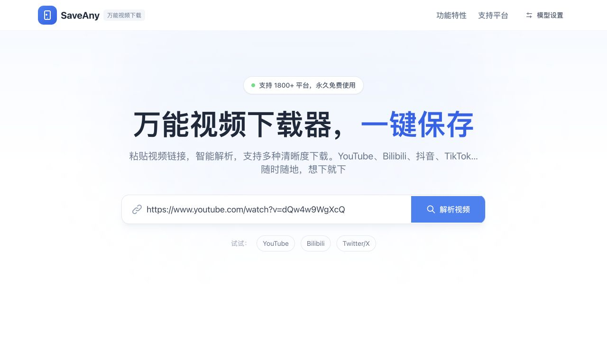
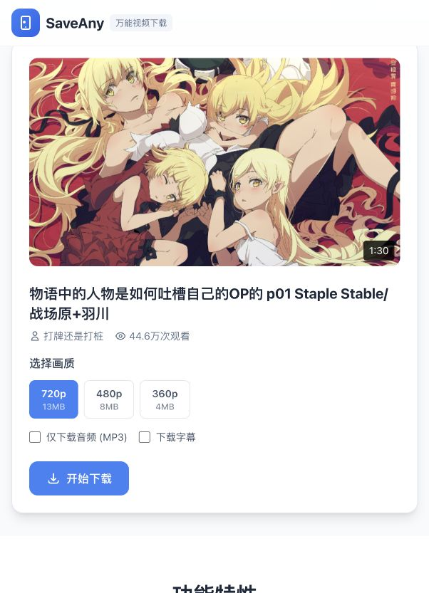
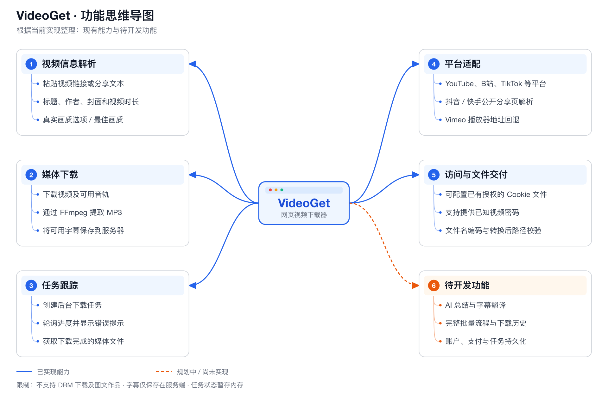

# VideoGet

[English](README.md) | **简体中文**

基于 Vue 3、FastAPI、yt-dlp 和 FFmpeg 的网页视频下载器。粘贴视频链接，查看可用画质，下载视频或提取 MP3 音频。

前端默认英文，保留原始蓝色 SaveAny 布局。通过右上角“模型设置”配置模型服务，输出 Token 默认上限为 **16384**，界面允许调整至 32768，具体需符合服务商支持的范围。

VideoGet 目前处于早期 MVP 阶段。下载流程已接入真实后端 API，原始项目文档中的部分功能仍处于规划阶段。

## 页面截图

首页截图展示当前中文界面和右上角模型设置入口；视频详情截图来自后端成功解析的 Bilibili 视频。界面保留 SaveAny 品牌名称。

前端默认显示英文；通过 `?lang=zh-CN` 访问中文界面，通过 `?lang=en` 显式选择英文。英文 README 使用英文界面的独立截图。

<p>
  
  
</p>

## 功能思维导图

蓝色分支表示已实现能力，橙色分支表示待开发功能。



[可编辑 SVG](docs/images/feature-mindmap.zh-CN.svg) · [English map](docs/images/feature-mindmap.en.png)

安装 `rsvg-convert` 后，可运行 `python3 scripts/generate-feature-maps.py` 重新生成两种语言的导图。

## 功能

- 解析视频标题、作者、封面、时长和可用画质。
- 下载含音轨的视频，或提取 MP3 音频。
- 通过进度条查看后台下载任务。
- 提取已有字幕，或通过云端 / 本地 Whisper 将语音转为文字，支持 SRT 和 TXT 下载。
- 配置模型服务后，可翻译带时间轴的字幕，并生成基于文字的 AI 总结。
- 可在前端配置 OpenAI / Anthropic 兼容服务或本地 Ollama；语音可单独接入云端服务，也可使用本地 Whisper。
- 使用内置适配器解析抖音和快手的公开移动分享页。
- 可配置服务端 Cookie 和已知视频密码，访问已有授权的内容。
- 响应式 Vue 界面及 Docker Compose 配置。

AI 功能需要配置模型服务，缺少配置时界面会明确提示。完整批量下载流程、账户及持久化下载历史尚未实现。视频下载会返回可用字幕文件地址，没有字幕时也会提示。

## 平台支持

| 平台 | 实现方式 | 样例验证结果 |
| --- | --- | --- |
| YouTube | yt-dlp | 下载及文件交付通过 |
| Bilibili（哔哩哔哩） | yt-dlp，附加封面回退 | 下载及文件交付通过 |
| 抖音 | 内置移动分享页解析 | 视频及 MP3 下载通过 |
| 快手 | 内置移动分享页解析 | 下载及文件交付通过 |
| TikTok | yt-dlp | 下载及文件交付通过 |
| Instagram | yt-dlp | 下载及文件交付通过 |
| Twitter / X | yt-dlp | 下载及文件交付通过 |
| Facebook | yt-dlp；分辨率未知时使用最佳画质 | 下载及文件交付通过 |
| Vimeo | yt-dlp，附加播放器地址回退 | 密码保护样例在提供其公开测试密码后通过 |
| Twitch | yt-dlp | 视频片段下载及文件交付通过 |

以上结果来自 `dev` 分支，测试使用 yt-dlp `2026.8.19`。成功样例均检查了文件交付，并通过 FFprobe 验证媒体有效；不代表这些平台的所有视频都能下载。其他 yt-dlp 支持的网站也可能适用。

抖音和快手适配器支持视频作品，不支持图文作品。抖音解析会保留游客会话 Cookie，并对暂时没有视频数据的响应进行有限重试。两个适配器均不再依赖此前缺失的 `backend/third_party` 目录。

Vimeo 原始测试样例需要密码；另一个公开样例返回了 DRM 保护的视频流，无法下载。私密、需要登录、密码保护、地区限制及 DRM 内容仍受原有访问条件限制；不支持 DRM 视频下载。

## 环境要求

- Python 3.11 或更高版本。
- Node.js 20 或更高版本及 npm。
- `PATH` 中可调用 FFmpeg 和 FFprobe，用于媒体合并、MP3 转换和真实下载验证。
- 使用容器时需要 Docker 和 Docker Compose，后端镜像已包含 FFmpeg。

## 快速开始

以下命令使用 Bash 或 zsh。默认版本位于 `main` 分支，后续开发使用 `dev` 分支。

```bash
git clone https://github.com/aurora-03/VideoGet.git
cd VideoGet
```

### 本地开发

在一个终端启动后端：

```bash
cd backend
python3 -m venv .venv
source .venv/bin/activate
python -m pip install -r requirements.txt
cp .env.example .env
python main.py
```

Windows PowerShell 中使用 `.\.venv\Scripts\Activate.ps1` 激活虚拟环境。

在另一个终端，从仓库根目录启动前端：

```bash
cd frontend
npm ci
npm run dev
```

- 前端：[http://localhost:3000](http://localhost:3000)
- 后端：[http://localhost:8000](http://localhost:8000)
- API 文档：[Swagger UI](http://localhost:8000/docs) / [ReDoc](http://localhost:8000/redoc)

### Docker Compose

从仓库根目录运行：

```bash
cp backend/.env.example backend/.env
mkdir -p backend/downloads
docker compose up --build -d
```

前后端端口与本地开发相同，下载文件持久保存在 `backend/downloads`。

前端默认请求 `http://localhost:8000/api`。部署到远程服务器、使用 HTTPS 或通过其他设备访问前，可在 `frontend/.env` 中设置 `VITE_API_BASE_URL`，并配置后端 CORS 来源。前端容器目前使用 Vite 预览服务，生产部署配置仍需完善。

## 配置

后端在初始化下载服务前加载 `backend/.env`。

| 变量 | 默认值 | 用途 |
| --- | --- | --- |
| `HOST` | `0.0.0.0` | 后端监听地址 |
| `PORT` | `8000` | 后端端口 |
| `DOWNLOAD_DIR` | `./downloads` | 媒体存储目录，相对于后端工作目录 |
| `ALLOWED_ORIGINS` | `.env.example` 中为 `http://localhost:3000,http://127.0.0.1:3000` | 逗号分隔的 CORS 来源 |
| `YTDLP_COOKIE_FILE` | 未设置 | 已有授权的 Netscape 格式 Cookie 文件路径 |
| `YTDLP_VIDEO_PASSWORD` | 未设置 | 密码保护视频的已知密码 |
| `CLOUD_BASE_URL` | 示例中为 `https://api.openai.com/v1` | 三个功能共用的云端 API 地址 |
| `CLOUD_API_KEY` | 未设置 | 共用的服务端云端密钥 |
| `CLOUD_PROTOCOL` | `openai` | `openai` Chat Completions 或 `anthropic` Messages 协议 |
| `AI_MAX_OUTPUT_TOKENS` | `16384` | 输出 Token 上限（适用时包含推理内容），可在模型设置中调整 |
| `CLOUD_ASR_MODEL` | 示例中为 `whisper-1` | 云端语音转写模型 |
| `CLOUD_TRANSLATION_MODEL` | 示例中为 `gpt-4o-mini` | 云端字幕翻译模型 |
| `CLOUD_SUMMARY_MODEL` | 示例中为 `gpt-4o-mini` | 云端总结模型 |
| `AI_PROVIDER` | `openai` | OpenAI、自定义兼容服务 `custom` 或本地 `ollama` |
| `AI_BASE_URL` | 共用云端地址 | 可单独覆盖文本模型服务地址 |
| `AI_MODEL` | OpenAI 模式下为 `gpt-4o-mini` | 云端文本备用模型，本地 Ollama 时需指定 |
| `AI_API_KEY` | 共用云端密钥 | 可单独覆盖文本服务密钥 |
| `ASR_BACKEND` | `api` | 云端 `api` 或本地 Faster Whisper：`local` |
| `ASR_MODEL` | `whisper-1` / `base` | 云端 / 本地语音模型 |
| `ASR_BASE_URL` | 共用云端地址 | 可单独覆盖语音转写服务地址 |
| `ASR_API_KEY` | 共用云端密钥 | 可单独覆盖语音服务密钥 |
| `ANALYSIS_MAX_DURATION` | `7200` | 可分析的视频已知时长上限，单位秒 |

`.env.example` 中的 `MAX_FILE_SIZE` 目前尚未执行限制。任务状态保存在内存中，后端重启后丢失；限流和自动文件清理尚未实现。

Cookie 文件需要后端可读。Docker 中须使用容器内的路径，并以只读卷挂载文件。请勿将 Cookie 文件或密码提交到 Git。

## 字幕、语音转文字与 AI

点击右上角导航栏的“模型设置”，即可填写服务地址、OpenAI / Anthropic 协议、API Key、翻译模型、总结模型、输出 Token 上限及云端 / 本地语音参数。点击“保存模型配置”后，当前浏览器后续任务立即使用新配置，无需编辑 `.env` 或重启后端。

新会话的输出 Token 默认上限为 **16384**，部署配置可以覆盖此默认值。推理模型可能先消耗 Token 生成思考内容，再输出正文。上限不是要求生成的总结长度，也不保证所有输入都能完整处理；可在模型设置中调整，数值需符合服务商限制。

前端提交的配置在服务端内存中保存最多两小时，通过 HttpOnly、SameSite Cookie 隔离不同浏览器会话。设置接口不回传密钥，应用也不把密钥写入浏览器 localStorage / sessionStorage。同一服务密钥留空可保留；更换服务地址或协议时需重新填写。独立语音地址与共享地址不同时，需要单独填写语音密钥。后端重启会使会话失效，正在运行的任务仍使用启动时的配置快照。`.env` 继续作为部署默认配置，前端保存不会修改该文件。

部署时，前端与后端应位于同一站点（例如通过 `/api` 反向代理）；完全不同站点之间无法共享严格的会话 Cookie。

解析视频后，可以使用“字幕与 AI 助手”面板：

1. **提取字幕**：读取平台已有字幕，无需下载完整视频，可选择原文和目标语言。
2. **语音转文字**：获取音频并生成带时间轴的文字。勾选“无字幕时使用语音转文字”后，没有字幕时可自动转写。
3. **翻译字幕**：保留原始时间轴，导出译文 SRT。**生成 AI 总结**：对完整文本分段处理并合并，不会只截取开头内容。

后续翻译和总结会复用已提取的原文。结果可以查看并下载为 SRT / TXT；模型请求失败时，已经提取的原文仍可用于重试。总结基于字幕或语音内容，不会描述文字中没有的画面信息。当前翻译和总结支持中文、英语、日语、韩语、西班牙语、法语和德语。

使用自定义兼容服务时，在 `backend/.env` 配置共用云端地址、密钥及服务商提供的模型名：

```dotenv
AI_PROVIDER=custom
ASR_BACKEND=api
CLOUD_BASE_URL=https://你的云服务地址/v1
CLOUD_API_KEY=
CLOUD_ASR_MODEL=你的语音模型名
CLOUD_TRANSLATION_MODEL=你的翻译模型名
CLOUD_SUMMARY_MODEL=你的总结模型名
```

将示例地址和模型名替换为服务商的真实值，实际密钥填在前端设置或本地 `.env` 文件中，不要写入提交到 Git 的文件。上述 OpenAI 兼容示例要求文本服务支持 `/chat/completions`；云端语音需要支持 `/audio/transcriptions` 和带时间段的 `verbose_json` 响应。如果文本服务不支持语音，可通过 `ASR_BASE_URL`、`ASR_API_KEY` 和 `ASR_MODEL` 单独接入另一家语音服务。

文本服务也可通过 `AI_BASE_URL` / `AI_API_KEY` 单独覆盖，留空时继承共享配置。`AI_PROVIDER=custom` 时，缺少地址或模型名不会自动回退到 OpenAI，也不会将环境中其他 `OPENAI_API_KEY` 转发给自定义服务。`openai` 模式保留 OpenAI 默认地址、默认模型和旧环境变量兼容。

接入 Anthropic 兼容服务时，设置 `CLOUD_PROTOCOL=anthropic`，并填入服务商给出的 Base URL（例如以 `/apps/anthropic` 结尾的地址）。文本调用使用 `/v1/messages` 和 `x-api-key`，只展示响应中的文本块，不展示思考块。此文本入口不能直接当作 `/audio/transcriptions` 使用；语音需配置独立服务或选择本地 Whisper。协议说明见[阿里云 Messages 文档](https://help.aliyun.com/zh/model-studio/anthropic-api-messages)。

只有修改 `.env` 中的部署参数后才需要重启后端并刷新页面；前端配置保存后立即生效。语音、翻译和总结的就绪状态分别显示；设置接口不回传已保存的密钥。`backend/.env` 被 Git 忽略，仓库仅包含空密钥示例，不包含本地部署使用的私有服务地址、密钥及模型配置。

使用本地转写时，在后端虚拟环境中安装可选依赖：

```bash
python -m pip install -r backend/requirements-asr.txt
```

随后在前端选择“本地 Whisper”及 `base` 等模型，或在 `backend/.env` 设置 `ASR_BACKEND=local`、`ASR_MODEL=base`。首次使用会下载模型；CPU 快速测试可选 `tiny`，较大模型需要更多资源。音频分为十分钟的单声道 PCM 分片，云端上传控制在大小限制以内；本地转写的音频留在服务器。CPU 转写可能耗时较长，且存在错字，使用前请核对结果。

### 常见分析问题

| 现象 | 原因 / 处理方式 |
| --- | --- |
| 没有可用字幕 | 视频没有可读取的平台字幕，请使用“语音转文字”，或勾选无字幕时转写。 |
| 转写一直显示 30% | 当前进度在音频分片处理完成后更新，不会逐句更新。不满十分钟的视频只有一个分片，完成前可能一直显示 30%；仅凭此状态不能判断失败。 |
| AI 输出被截断或拒绝 | 当前提示合并了多个服务端结束原因。若是 `max_tokens`，可在服务商允许范围内提高上限；思考内容可能在正文生成前耗尽预算。真正的拒绝不能靠增加 Token 解决。 |
| 模型配置会话过期 | 刷新页面并重新配置。前端会话是临时的，持久化部署默认值应写入 `.env`。 |
| 重启后任务消失 | 任务引用保存在内存中，重启后不能继续复用；已生成文件仍在磁盘上，除非另行删除。 |

使用本地文本模型时，启动已有 Ollama 服务，设置 `AI_PROVIDER=ollama`、`AI_BASE_URL=http://localhost:11434/v1`，并将 `AI_MODEL` 设为已安装的模型名，此模式不需要文本 API Key。Docker 后端需要使用容器可访问的服务地址，而非宿主机的 `localhost`。

为 Docker 后端镜像安装本地转写依赖：

```bash
docker compose build --build-arg INSTALL_LOCAL_ASR=true backend
docker compose up -d
```

分析服务目前允许两个任务并行，时长上限可配置，任务状态仍保存在内存中。云端处理会将文字或音频发送给配置的模型服务；不希望发送时可使用本地模式。

接口依据 [OpenAI 语音转写说明](https://developers.openai.com/api/docs/guides/speech-to-text) 和 [JSON 输出格式](https://developers.openai.com/api/docs/guides/structured-outputs) 实现，本地语音识别使用 [Faster Whisper](https://github.com/SYSTRAN/faster-whisper)。

## API

| 方法 | 接口 | 用途 |
| --- | --- | --- |
| `POST` | `/api/video/info` | 解析视频链接，返回信息及画质选项 |
| `GET` | `/api/video/thumbnail?url=...` | 代理获取封面图片 |
| `POST` | `/api/download` | 创建后台下载任务 |
| `GET` | `/api/ai/capabilities` | 返回文本和语音服务配置状态，不包含密钥 |
| `GET` | `/api/ai/settings` | 返回当前浏览器会话参数及密钥是否存在，不返回密钥值 |
| `POST` | `/api/ai/settings` | 保存当前浏览器的模型参数，不修改全局环境配置 |
| `POST` | `/api/video/analyze` | 启动字幕提取、语音转写、字幕翻译或总结任务 |
| `GET` | `/api/task/{task_id}` | 获取任务状态、进度和完成后的文件地址 |
| `GET` | `/api/download/file/{filename}` | 获取已下载的文件 |
| `GET` | `/api/supported-platforms` | 返回项目声明的平台列表 |
| `GET` | `/health` | 基础后端健康检查 |

文件先下载到服务器，再交付到浏览器。画质选择以请求的分辨率为上限；分辨率未知的视频提供“最佳画质”选项。

分析任务响应包含 `stage`、`progress` 和 `result`，结果提供带时间轴的 `segments`、原文、可选译文 / 总结及下载地址。使用 `source_task_id` 可以复用已有文本。字幕提取无需 AI 密钥；语音和文本操作缺少必需服务配置时会明确报错。

## 测试与构建

激活后端虚拟环境后，从仓库根目录安装开发依赖并运行回归测试：

```bash
python -m pip install -r backend/requirements-dev.txt
PYTHONPATH=backend python -m unittest discover -s backend/tests -v
```

按需运行连接真实后端和平台链接的网络测试：

```bash
python backend/tests/live_platforms.py --platform Facebook 抖音 快手
YTDLP_VIDEO_PASSWORD=youtube-dl python backend/tests/live_platforms.py --platform Vimeo
python backend/tests/live_platforms.py --platform YouTube --audio
python backend/tests/live_platforms.py --platform Vimeo --url https://vimeo.com/VIDEO_ID
```

默认 Vimeo 样例是 yt-dlp 官方的密码保护测试视频，公开测试密码为 `youtube-dl`。这是测试样例的密码，并非其他视频的默认密码。

真实测试会下载视频、验证文件交付，并使用 FFprobe 检查媒体。报告及下载文件保存在 `backend/downloads/verification-*`；样例可能随时间失效。脚本还支持 `--timeout` 和 `--output` 参数。

构建前端：

```bash
cd frontend
npm run build
```

## 项目结构

```text
VideoGet/
├── frontend/
│   ├── src/App.vue              # 下载流程及任务轮询
│   ├── src/components/          # Vue 界面组件
│   └── package.json
├── backend/
│   ├── api/routes.py            # FastAPI 接口
│   ├── services/downloader.py   # yt-dlp 集成及媒体交付
│   ├── services/share_parser.py # 抖音和快手适配器
│   ├── services/task_manager.py # 内存任务状态
│   ├── tests/                   # 回归测试及按需运行的真实测试
│   ├── downloads/               # 生成的媒体及测试报告，Git 忽略
│   ├── main.py
│   ├── requirements.txt
│   ├── requirements-dev.txt
│   └── .env.example
├── docker-compose.yml
├── docs/images/                 # 页面截图与双语功能导图
├── scripts/generate-feature-maps.py # 重新生成 SVG 和 PNG 功能导图
├── README.md                    # 默认英文文档
└── README.zh-CN.md               # 简体中文文档
```

[PRD.md](PRD.md)、[PROJECT_SUMMARY.md](PROJECT_SUMMARY.md) 和 [DESIGN_SYSTEM.md](DESIGN_SYSTEM.md) 为原始规划和设计资料，部分内容早于当前实现；现有能力以代码和本 README 为准。

## 文档语言

`README.md` 默认使用英文，`README.zh-CN.md` 提供简体中文。修改能力、配置或启动说明时，请同步两份文档。新增译文可使用 `README.<语言代码>.md` 命名，并在各 README 顶部的语言切换链接中列出。

## 贡献与使用

欢迎提交 Issue 和 Pull Request。当前开发使用 `dev` 分支，修改时请附上相关回归验证。

仅下载已有权限保存的内容，并遵守平台条款及版权要求。原始项目文档声明使用 MIT 许可证，但当前仓库尚未包含独立的 `LICENSE` 文件。
